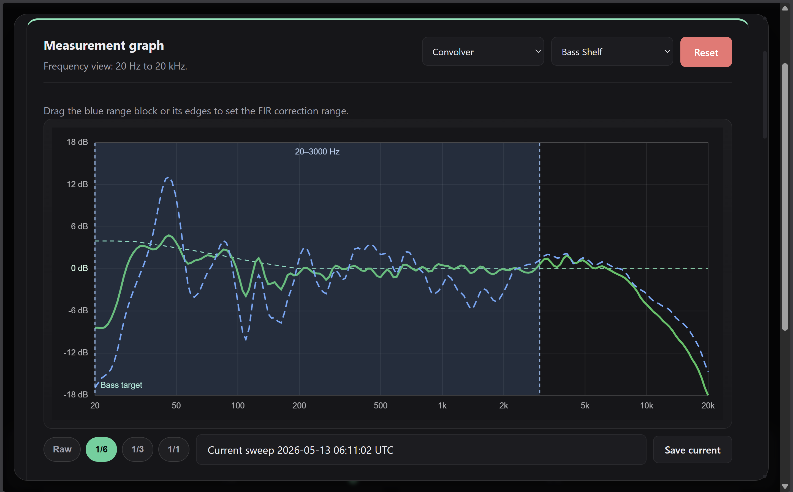
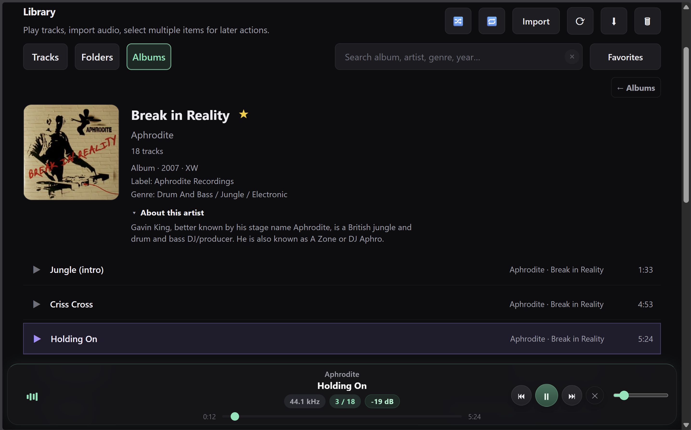
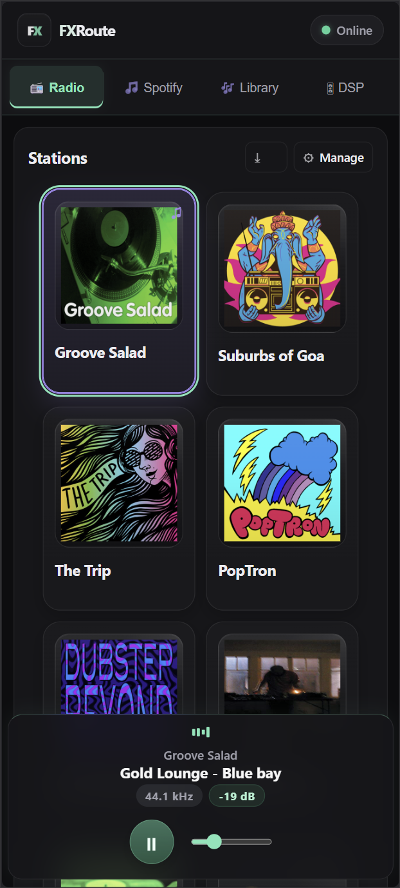
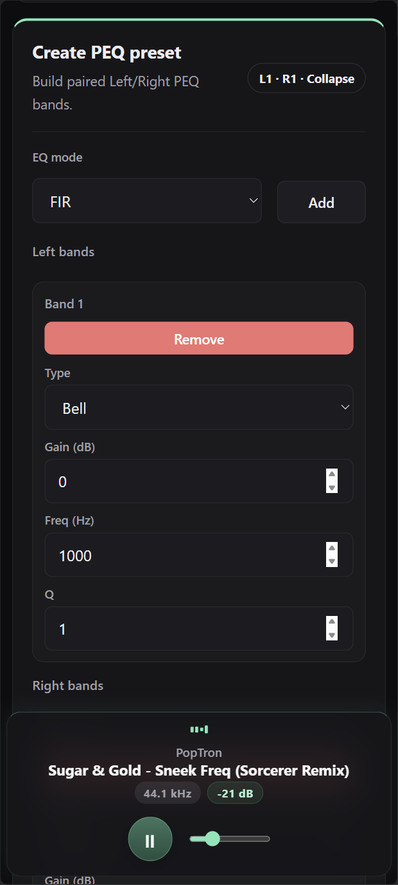

# FXRoute

FXRoute is a browser-based audio control surface for Linux listening machines.

It is built for mini PCs, desktops, ARM boards, and dedicated stereo boxes that run local playback, EasyEffects DSP, radio, library playback, measurement tools, and optional Spotify desktop control — all remote-controlled from a phone, tablet, or laptop on the local network.

<p align="center">
  
</p>

<p align="center">
  <strong>Measure, compare, and sketch PEQ/convolver corrections directly in the browser.</strong>
</p>

<table>
  <tr>
    <td width="50%"></td>
    <td width="50%"></td>
  </tr>
  <tr>
    <td align="center"><strong>Playback and routing</strong></td>
    <td align="center"><strong>DSP presets and A/B compare</strong></td>
  </tr>
  <tr>
    <td width="50%"></td>
    <td width="50%"></td>
  </tr>
  <tr>
    <td align="center"><strong>Measurement PEQ editor</strong></td>
    <td align="center"><strong>Album artist info</strong></td>
  </tr>
</table>

<table>
  <tr>
    <td width="33%"></td>
    <td width="33%"></td>
    <td width="33%"></td>
  </tr>
  <tr>
    <td align="center"><strong>Mobile library</strong></td>
    <td align="center"><strong>Mobile radio</strong></td>
    <td align="center"><strong>Mobile PEQ preset</strong></td>
  </tr>
</table>

## What it does

- browser UI for desktop and mobile control
- local music playback with queue, playlists, uploads, ZIP album imports, album browsing, cached album metadata, artist info, similar-artist discovery, and media URL imports
- internet radio with built-in and custom stations
- Spotify desktop control through `playerctl` / MPRIS, including passive metadata refresh for automatic track changes
- EasyEffects preset switching, PEQ, convolver import/generation, output helpers, and A/B compare
- global DSP helpers such as limiter, headroom, autogain, bass enhancement, and tone modes
- practical room/speaker measurement workflow with host microphone capture, calibration files, smoothing, saved runs, PEQ draft transfer, and stereo FIR/convolver preset creation with linear, minimum-phase, minimum-aligned, and hybrid-aligned modes
- sample-rate-aware playback handling for local files, radio, Spotify, and Bluetooth handoff cases
- Bluetooth input visibility/control when the host audio stack supports it
- optional local HTTPS/Caddy setup with downloadable local certificate for trusted LAN clients
- installer support for systemd user service, Flatpak EasyEffects, PipeWire/BlueZ dependencies, firewall comfort rules, and `.local` LAN naming

## Intended setup

FXRoute is meant for a **Linux desktop-session audio box**, not a fully headless rack server.

Typical setup:

- small PC or ARM board near DAC, amp, active speakers, headphones, or TV
- PipeWire-based Linux desktop session
- EasyEffects running in the same local user session
- optional Spotify desktop client in the same session
- control from any browser on the LAN

The user session matters because FXRoute coordinates local audio applications, EasyEffects, MPRIS/playerctl, and PipeWire audio routes. In socket mode, EasyEffects runs as a background service in that session.

## Requirements

On supported distros, `install.sh` installs and configures the required runtime tools such as Python dependencies, `mpv`, `ffmpeg`, `playerctl`, Bluetooth/PipeWire helpers, and service files.

EasyEffects is handled separately: fresh installs can use the installer-managed Flatpak path, while existing native/package-manager EasyEffects installs are accepted when already present.

Tested installer targets so far include:

- Ubuntu 24.04 and 26.04 on x86_64
- Manjaro / Arch-family x86_64 systems
- openSUSE Tumbleweed on x86_64
- Fedora-family x86_64 systems
- Armbian 26.2.1 / Ubuntu 24.04 Noble on ARM64 (`aarch64`, Khadas VIM1S; PipeWire setup may be needed depending on the image)

## EasyEffects mode

The installer prefers **Flatpak EasyEffects** when it installs EasyEffects itself. This is the most reproducible path and normally provides the EasyEffects control socket used by FXRoute for faster preset switching and recovery.

If EasyEffects is already installed through the system package manager or managed manually by the user, FXRoute can use that installation instead. Older native EasyEffects builds may not expose the control socket; in that case FXRoute falls back to EasyEffects CLI control where possible.

Fresh installs default Spotify autostart to enabled when a local Spotify desktop client is available, so the player can return after a desktop/session restart. Existing `.env` files are preserved on installer reruns.

## Maintenance updates

Installed git checkouts can be updated from **Technical settings → Maintenance** or from the `fxroute-update` helper. The update path uses the same install root, service name, virtualenv, and systemd user service assumptions as `install.sh`.

The updater is intentionally conservative: it refuses to run with local uncommitted changes, fetches GitHub first, pulls only by fast-forward, refreshes Python dependencies only when `requirements.txt` changed, runs the production validation/build step, and restarts the configured FXRoute user service. User data under `~/.config/fxroute`, measurements, presets, filters, music files, and `.env` are not migrated or reset by this updater.

## Quick start

```bash
chmod +x install.sh
./install.sh
```

The installer creates `.env` automatically and preserves it on reruns. For manual setup, copy `.env.example` to `.env` and adjust at least `MUSIC_ROOT` when needed. A NAS library can be used by mounting its SMB/Samba share locally, for example under `/mnt/music`, and setting `MUSIC_ROOT=/mnt/music`.

Default user service:

- `fxroute.service`

Typical URLs:

- `http://localhost:8000`
- `http://<host-ip>:8000`
- `http://fxroute.local` when mDNS is enabled
- `https://<host-ip>` or `https://fxroute.local` when the optional local HTTPS proxy is enabled

## Main sections

- **Radio** — built-in and custom internet stations
- **Library** — local files, album browsing, cached metadata, artist info, similar-artist discovery, playlists, uploads, imports, downloads, and deletion
- **DSP** — EasyEffects presets, PEQ, convolver, helpers, A/B compare, and preset creation
- **Measure** — practical host-mic measurement and tuning workflow
- **Spotify** — control a local Spotify desktop client
- **Technical settings** — output selection, source state, Bluetooth status, Maintenance updates, and local certificate access

## Library metadata

FXRoute keeps local tags and local cover files as the source of truth, then enriches albums opportunistically with cached MusicBrainz IDs, Cover Art Archive fallback covers, compact album facts, optional Wikipedia/Wikidata artist summaries, and ListenBrainz similar-artist discovery.

Metadata is cached locally so normal library scans stay fast and unchanged tracks do not need full audio probing on every run.

## Measurement and convolver presets

The Measure workflow can create EasyEffects-ready FIR/convolver presets from saved measurements. For stereo correction, measure and save left and right separately, assign them in the Convolver assistant, then choose the target curve, correction range, phase mode, sample rate, and tap length.

Available phase modes:

- **Linear phase** — symmetric FIR correction.
- **Minimum phase** — practical default for broad room/speaker correction.
- **Minimum phase aligned** — minimum-phase correction with measured L/R direct-arrival alignment for separately saved stereo measurements.
- **Hybrid aligned** — minimum-phase bass correction blended into zero-delay linear-style upper correction, using the same L/R timing safety gate as Minimum phase aligned for stereo drafts.

## Service commands

```bash
systemctl --user status fxroute
systemctl --user restart fxroute
journalctl --user -u fxroute -f
```

Useful EasyEffects checks:

```bash
flatpak list --app | grep easyeffects
pgrep -af easyeffects
```

## Manual

See [MANUAL.md](MANUAL.md) for the short user manual.

## License

See [LICENSE](LICENSE).
