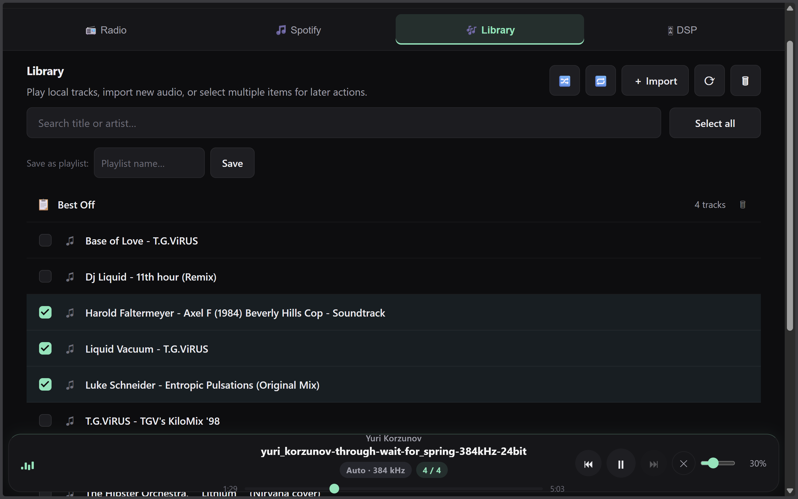
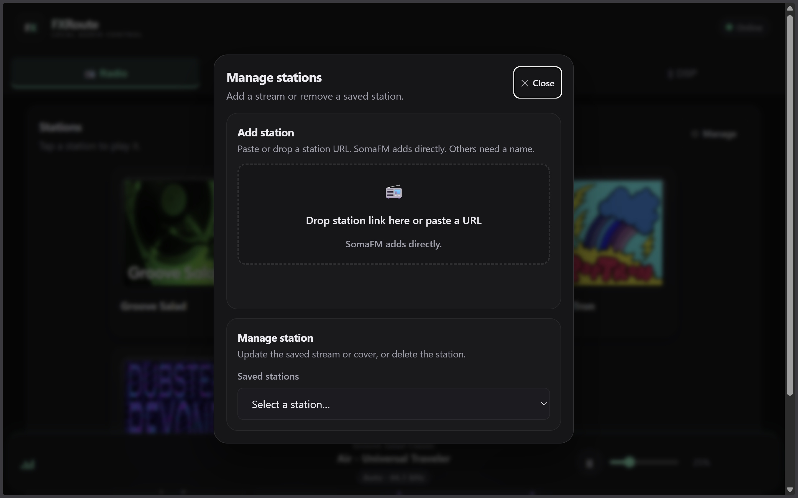
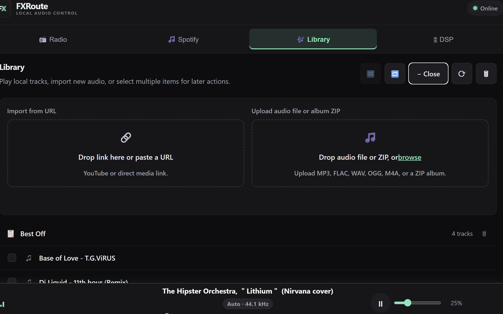
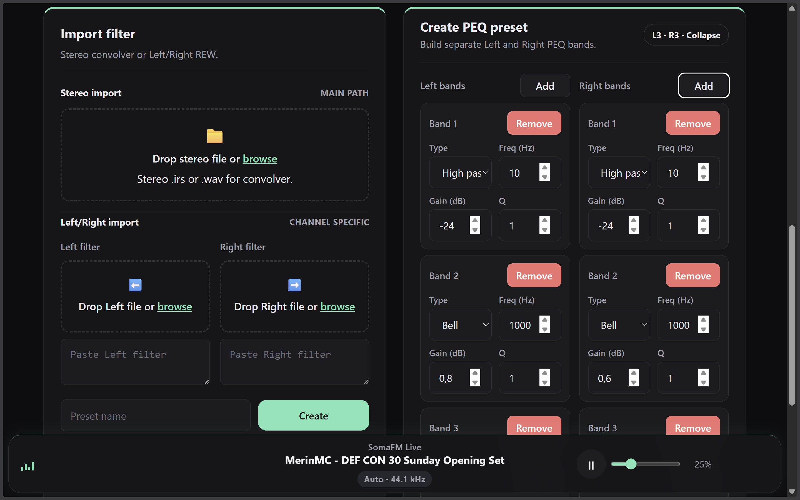

# FXRoute

FXRoute is a browser-controlled audio player and DSP control surface for Linux mini PCs and dedicated audio machines.

It is built for the kind of box you put next to a DAC, amp, or TV: a small Linux PC that runs local playback, radio, EasyEffects, and Spotify desktop control, while every phone, tablet, or laptop on the local network can act as the remote.


| Library and playlist control | Spotify desktop control | DSP presets and A/B compare |
| --- | --- | --- |
|  |  |  |

| Radio management | Library import | Filter import and PEQ editing |
| --- | --- | --- |
|  |  |  |

## Why FXRoute

FXRoute focuses on practical high-quality playback on Linux audio systems.

FXRoute is built to remove as much Linux audio setup friction as possible, including the usual PipeWire / EasyEffects / sample-rate headaches that often turn into long manual setup guides.

- browser control from any device on the local network
- optimized for mini PCs, NUC-style hosts, and dedicated living-room audio boxes, but also perfectly usable on a normal Linux desktop or laptop
- local playback, playlists, and straightforward library import in one interface
- SomaFM radio with live metadata plus support for generic custom station URLs
- EasyEffects-based DSP workflows with preset switching, convolver, PEQ, and practical helpers
- digital room correction workflows through convolver presets and PEQ / REW-based tuning
- fast A/B comparison for filter and preset listening
- gapless playback for consecutive tracks at the same sample rate
- monitoring and utility features such as peak detection, headroom control, limiter, delay, and bass enhancement
- Spotify desktop control through MPRIS / `playerctl`
- responsive UI for desktop and mobile
- careful sample-rate handling for high-quality playback, including high-resolution setups where the DAC and Linux audio chain support it

## Supported setup

Validated so far:
- Ubuntu
- Fedora
- openSUSE Tumbleweed

FXRoute expects a modern PipeWire-based Linux desktop audio stack. On Ubuntu, 24.04+ is the clearest target; Fedora and openSUSE Tumbleweed already fit that model naturally.

Typical real-world setup, but not a requirement:
- mini PC or small desktop near the stereo, DAC, or TV
- Linux desktop session on that machine
- browser control from phone, tablet, or laptop
- optional monitor attached, but not needed day to day

## Important setup assumption

FXRoute is not a pure headless audio stack.

Some of its best features depend on desktop-session apps:
- EasyEffects runs in the local user session
- Spotify control targets the locally running Spotify desktop app

So the intended model is not "cloud server in a rack", but "dedicated Linux audio box you rarely have to touch directly".

## What FXRoute needs

On supported distros, the installer usually takes care of `mpv`, `ffmpeg`, Python 3, `playerctl`, and EasyEffects for you. In practice, the main requirements are:

- a Linux desktop session with working PipeWire audio
- `systemd --user` available in that session
- a distro supported by the installer (`apt`, `dnf`, or `zypper`)
- a browser on the same local network

## Quick start

### Recommended install

Clone the repo, enter the project directory, and run the installer from the project root:

```bash
./install.sh
```

If the script is not executable in your environment, use:

```bash
chmod +x install.sh
./install.sh
```

For a non-interactive run:

```bash
./install.sh -y
```

Default public install path:
- `~/fxroute`

Default user service:
- `fxroute.service`

The installer prepares:
- required system packages
- Python virtual environment
- user service
- EasyEffects bootstrap presets
- optional LAN comfort steps such as `.local` naming and port-80 reverse proxy

### First configuration

If you want to create or adjust the config manually:

```bash
cp .env.example .env
```

Minimum required setting:

```env
MUSIC_ROOT=~/Music
```

Useful optional settings:
- `DOWNLOADS_SUBDIR=incoming`
- `LOG_LEVEL=INFO`
- `HOST=0.0.0.0`
- `PORT=8000`
- `SPOTIFY_AUTOSTART=off|on`
- `SPOTIFY_CACHE_CLEANUP=off|on`
- `SPOTIFY_CACHE_CLEANUP_INTERVAL_HOURS=24`
- `SYSTEM_AUTO_UPDATE=off|on`
- `SYSTEM_AUTO_UPDATE_INTERVAL_HOURS=24`

Downloads are stored under `MUSIC_ROOT/incoming` by default.

Background helpers should stay opt-in and outside the live audio settings UI. Things like Spotify autostart, Spotify cache cleanup, or optional automatic system package updates are better treated as setup/environment-driven helpers and should remain off by default unless the user explicitly enables them. When Spotify autostart is enabled, FXRoute starts Spotify through its own helper so it can run the optional cache cleanup first and then launch the detected Flatpak or native Spotify app.

### Uninstall

If you want to remove FXRoute again later, run:

```bash
./uninstall.sh
```

## Access and usage

Typical URLs are:
- `http://localhost:8000`
- `http://<host-ip>:8000`
- `http://fxroute.local` when Avahi/mDNS is enabled
- `http://<host-ip>` when the optional port-80 reverse proxy is enabled

Basic flow:
1. Open FXRoute in a browser on your local network.
2. Use **Radio** for SomaFM streaming or your own generic custom stations.
3. Use **Library** for local playback, playlists, and import.
4. Use **Library** import for quick file upload or URL-based import into the local collection. URL downloads now keep the source audio format whenever possible instead of forcing MP3 conversion, including formats like WebM/Opus when that is what the source provides.
5. Use **Effects** for EasyEffects preset switching, convolver and PEQ work, DRC-oriented tuning workflows, DSP helpers, A/B listening, and utility controls like peak detection, headroom, limiter, delay, and bass enhancement. The built-in PEQ workflow currently supports up to 20 bands per side in v1.
6. Use **Spotify** to control a locally running Spotify desktop client.

## Running and service control

### Manual run

```bash
python3 main.py
```

### User service

FXRoute is designed to run as a **systemd user service** so playback stays tied to the desktop session.

| Action | Command |
|--------|--------|
| Status | `systemctl --user status fxroute` |
| Logs | `journalctl --user -u fxroute -f` |
| Restart | `systemctl --user restart fxroute` |
| Stop | `systemctl --user stop fxroute` |
| Disable | `systemctl --user disable fxroute` |

Minimal example unit file:
- `fxroute.service`

## Architecture

```text
fxroute/
├── main.py           # FastAPI app with REST + WebSocket endpoints
├── player.py         # MPV wrapper using JSON IPC
├── stations.py       # Editable station storage and stream URL handling
├── library.py        # Local music scanner (mutagen for metadata)
├── downloader.py     # yt-dlp integration with progress tracking
├── config.py         # Configuration from .env
├── models.py         # Data models
├── requirements.txt  # Python dependencies
├── .env.example      # Example config
├── fxroute.service   # example systemd unit file
├── README.md         # This file
└── static/
    ├── index.html    # Single-page app
    ├── style.css     # Dark theme, responsive
    └── app.js        # Vanilla JS, WebSocket client
```

### Data flow
- frontend connects via WebSocket for real-time state
- REST endpoints for explicit actions like play, pause, import, and effects
- MPV runs as a subprocess with JSON IPC at `/tmp/mpv.sock`
- station data is cached in SQLite at `/tmp/fxroute-cache/stations.db`
- downloads go to `MUSIC_ROOT/incoming/`

## Troubleshooting

### "mpv is not installed"
On supported distros, the installer normally takes care of mpv for you. If you are running a manual/custom setup, install mpv and then retry.

### "MUSIC_ROOT is not set"
The installer normally creates `.env` for you with `MUSIC_ROOT=~/Music` and prepares the default incoming folder. If you are running a manual/custom setup, make sure your `.env` exists and contains a valid `MUSIC_ROOT`.

### WebSocket connection fails
- preferred LAN setup: Avahi/mDNS for `fxroute.local` plus Caddy on port 80
- fallback direct app port: `http://<host-ip>:8000`
- check firewall for port `8000`, for example:
  - Ubuntu: `sudo ufw allow 8000`
  - Fedora: `sudo firewall-cmd --add-port=8000/tcp --permanent && sudo firewall-cmd --reload`
  - openSUSE: `sudo firewall-cmd --add-port=8000/tcp --permanent && sudo firewall-cmd --reload`
- verify the backend is running: `curl http://localhost:8000/api/status`
- verify the reverse proxy is running: `curl http://localhost/api/status`

### Downloads fail
- on supported distros, the installer normally provides `yt-dlp` inside the FXRoute virtual environment for you
- URL downloads keep the source audio format whenever possible; if you explicitly want transcoding, set `DOWNLOAD_TRANSCODE_FORMAT` in `.env`
- YouTube changes frequently, so if downloads consistently fail, update `yt-dlp` inside the FXRoute virtual environment:
  ```bash
  cd ~/fxroute && .venv/bin/pip install -U yt-dlp
  ```
- some sources have restrictions, try a different URL

### Effects do not apply
- on supported distros, the installer normally takes care of EasyEffects for you, but it still needs to be running in the desktop session
- if preset loading fails, verify FXRoute is still talking to the intended EasyEffects instance

### Spotify tab is empty or controls do not work
- ensure Spotify is installed and currently running in the desktop session
- ensure `playerctl` is available: `playerctl --version` (on supported distros, the installer normally takes care of it)
- check whether Spotify is visible to MPRIS/playerctl: `playerctl --list-all | grep spotify`
- if nothing shows up, start Spotify locally on the host and try again

### Stations not loading
- the app falls back to a minimal station list if SomaFM API is unreachable
- check network connectivity
- stations may be temporarily unavailable

### No sound
- check that mpv can output audio: `mpv --no-video https://ice1.somafm.com/groovesalad`
- ensure volume is not muted in the app or system

## Contributing

FXRoute is still in an early, tightly curated stage.

Please discuss larger changes before opening a pull request.
Contribution terms are documented in:
- `CONTRIBUTING.md`
- `CONTRIBUTOR-LICENSE-GRANT.md`

## License

GNU AGPLv3
