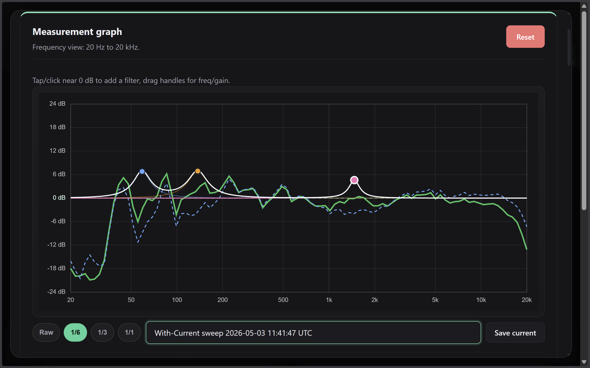
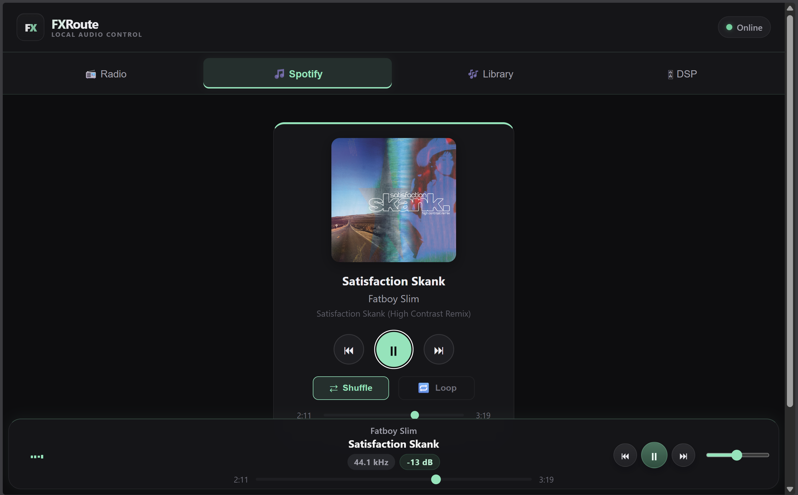
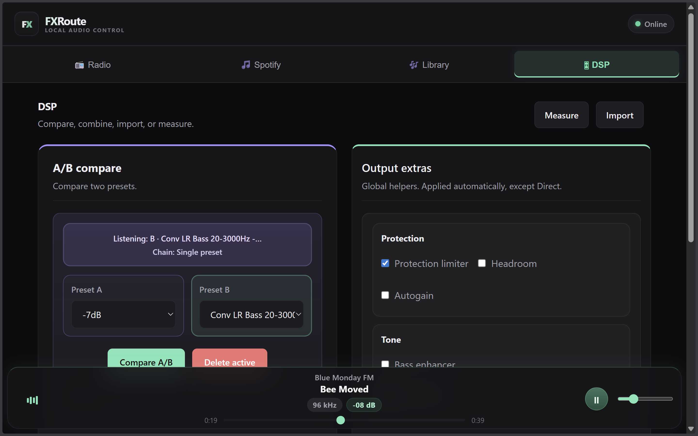
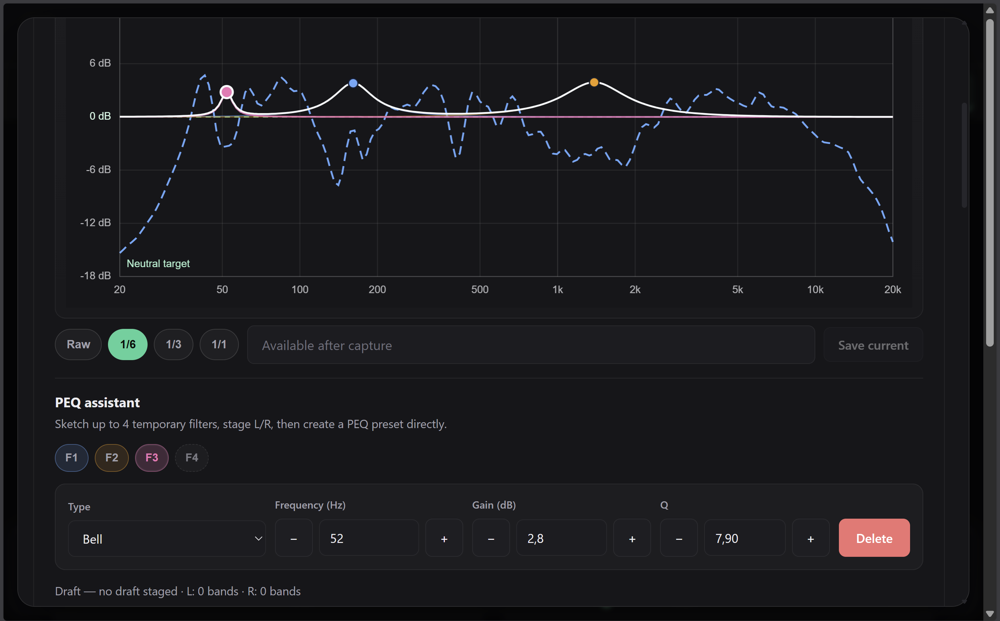
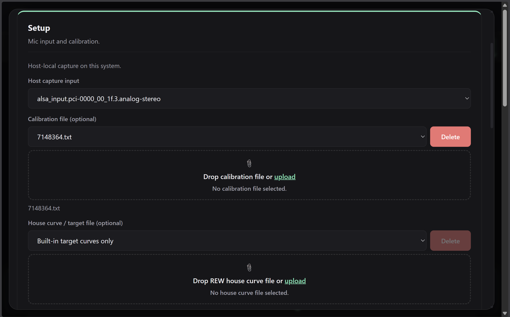
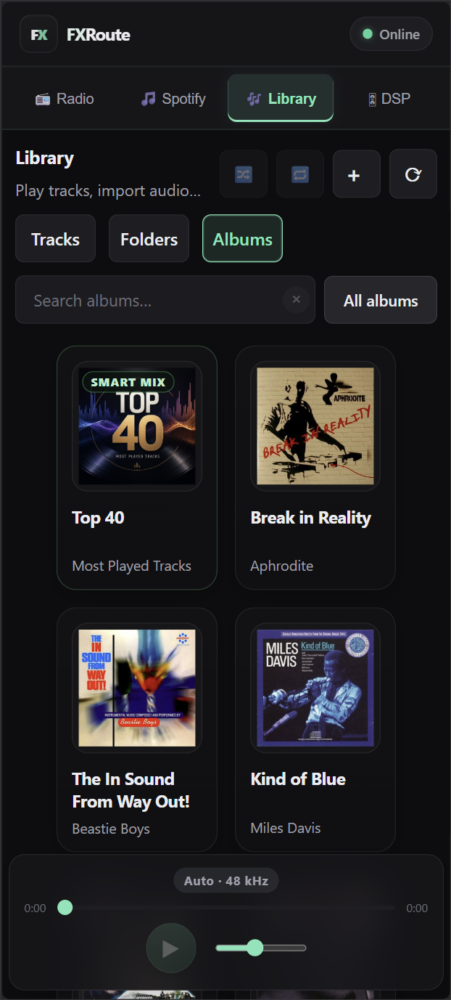
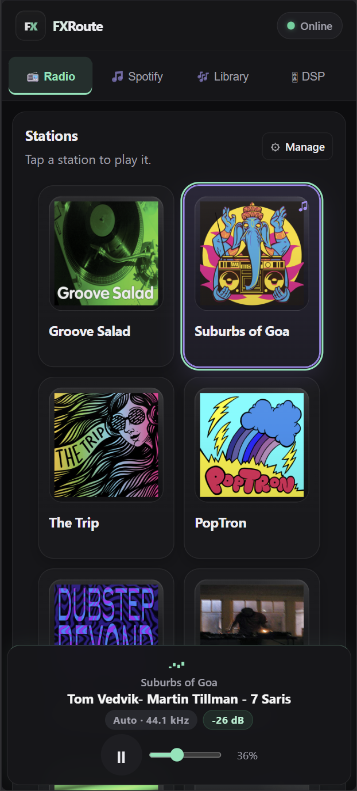
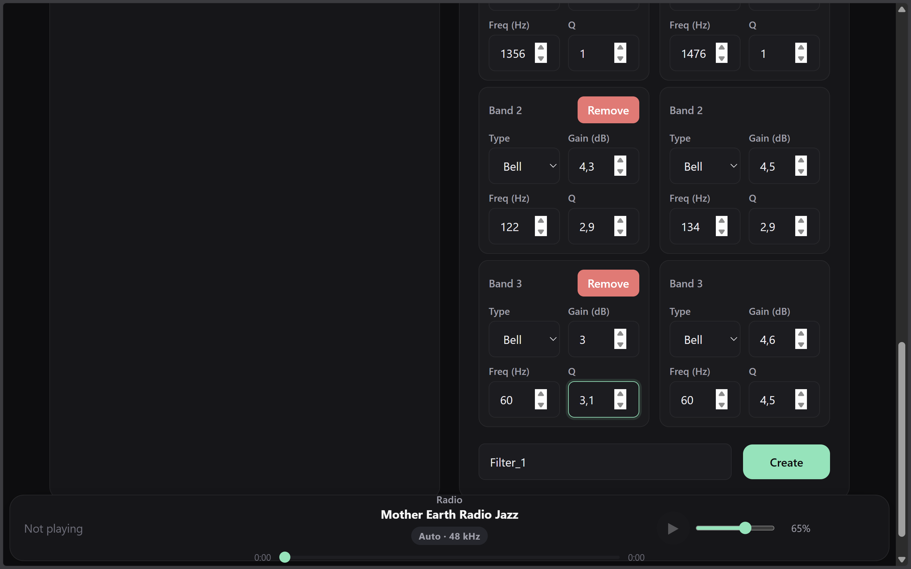

# FXRoute

FXRoute is a browser-based audio control surface for Linux listening machines.

It is built for mini PCs, desktops, ARM boards, and dedicated stereo boxes that run local playback, EasyEffects DSP, radio, library playback, measurement tools, and optional Spotify desktop control — all remote-controlled from a phone, tablet, or laptop on the local network.

<p align="center">
  
</p>

<p align="center">
  <strong>Measure, compare, and sketch PEQ corrections directly in the browser.</strong>
</p>

<table>
  <tr>
    <td width="50%"></td>
    <td width="50%"></td>
  </tr>
  <tr>
    <td align="center"><strong>Playback and routing</strong></td>
    <td align="center"><strong>DSP presets and A/B compare</strong></td>
  </tr>
  <tr>
    <td width="50%"></td>
    <td width="50%"></td>
  </tr>
  <tr>
    <td align="center"><strong>Measurement PEQ editor</strong></td>
    <td align="center"><strong>Audio output and source settings</strong></td>
  </tr>
</table>

<table>
  <tr>
    <td width="33%"></td>
    <td width="33%"></td>
    <td width="33%"></td>
  </tr>
  <tr>
    <td align="center"><strong>Mobile library</strong></td>
    <td align="center"><strong>Mobile solutions</strong></td>
    <td align="center"><strong>Mobile DSP</strong></td>
  </tr>
</table>

## What it does

- browser UI for desktop and mobile control
- local music playback with queue, playlists, uploads, ZIP album imports, and media URL imports
- internet radio with built-in and custom stations
- Spotify desktop control through `playerctl` / MPRIS
- EasyEffects preset switching, PEQ, convolver import, output helpers, and A/B compare
- global DSP helpers such as limiter, headroom, autogain, bass enhancement, delay, and tone modes
- practical room/speaker measurement workflow with host microphone capture, calibration files, smoothing, saved runs, and PEQ draft transfer
- sample-rate-aware playback handling for local files, radio, Spotify, and Bluetooth handoff cases
- Bluetooth input visibility/control when the host audio stack supports it
- optional local HTTPS/Caddy setup with downloadable local certificate for trusted LAN clients
- installer support for systemd user service, Flatpak EasyEffects, PipeWire/BlueZ dependencies, firewall comfort rules, and `.local` LAN naming

## Intended setup

FXRoute is meant for a **Linux desktop-session audio box**, not a fully headless rack server.

Typical setup:

- small PC or ARM board near DAC, amp, active speakers, headphones, or TV
- PipeWire-based Linux desktop session
- EasyEffects running in the same local user session
- optional Spotify desktop client in the same session
- control from any browser on the LAN

The desktop session matters because FXRoute coordinates real local audio applications and PipeWire routes, not a remote cloud playback backend.

## Requirements

Core requirements:

- Linux with PipeWire
- `systemd --user`
- Python 3
- `mpv`
- `ffmpeg`
- `playerctl`
- EasyEffects
- Flatpak, when FXRoute installs EasyEffects itself

On supported distros, `install.sh` handles most of this.

Tested installer targets so far include:

- Ubuntu 24.04 on x86_64
- openSUSE Tumbleweed on x86_64
- Fedora-family x86_64 systems
- Armbian 26.2.1 / Ubuntu 24.04 Noble on ARM64 (`aarch64`, Khadas VIM1S)

ARM64/Armbian support is expected to work with conservative performance expectations on slower boards.

## EasyEffects mode

The installer prefers **Flatpak EasyEffects** when it installs EasyEffects itself. This is the most reproducible path and normally provides the EasyEffects control socket used by FXRoute for faster preset switching and recovery.

If a user already has a native/package-manager EasyEffects installation, FXRoute can use it. Older native EasyEffects builds may not expose the control socket; in that case FXRoute falls back to EasyEffects CLI control where possible.

Recommended reproducible setup:

```bash
flatpak install --user flathub com.github.wwmm.easyeffects
```

## Quick start

```bash
chmod +x install.sh
./install.sh
```

Minimal config in `.env` when needed:

```env
MUSIC_ROOT=~/Music
```

Default user service:

- `fxroute.service`

Typical URLs:

- `http://localhost:8000`
- `http://<host-ip>:8000`
- `http://fxroute.local` when mDNS is enabled
- `https://<host-ip>` or `https://fxroute.local` when the optional local HTTPS proxy is enabled

## Main sections

- **Radio** — built-in and custom internet stations
- **Library** — local files, playlists, uploads, imports, downloads, and deletion
- **DSP** — EasyEffects presets, PEQ, convolver, helpers, A/B compare, and preset creation
- **Measure** — practical host-mic measurement and tuning workflow
- **Spotify** — control a local Spotify desktop client
- **Technical settings** — output selection, source state, Bluetooth status, and local certificate access

## Service commands

```bash
systemctl --user status fxroute
systemctl --user restart fxroute
journalctl --user -u fxroute -f
```

Useful EasyEffects checks:

```bash
flatpak list --app | grep easyeffects
pgrep -af easyeffects
```

## Notes and limits

- FXRoute controls **locally running** audio tools.
- It is designed for **trusted LAN use** and a dedicated listening machine.
- EasyEffects handles the live DSP/convolver runtime; FXRoute focuses on control, workflow, preset generation, and tuning support.
- The measurement workflow is practical and useful for tuning direction, but it is not a full replacement for dedicated acoustic measurement suites.
- Fully headless operation is not the primary target.

## Manual

See [MANUAL.md](MANUAL.md) for the short user manual.

## License

See [LICENSE](LICENSE).
