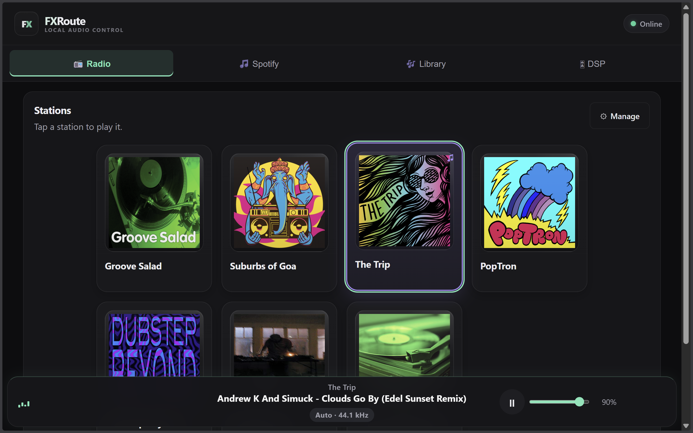
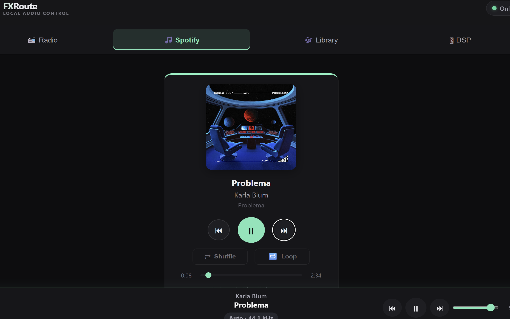
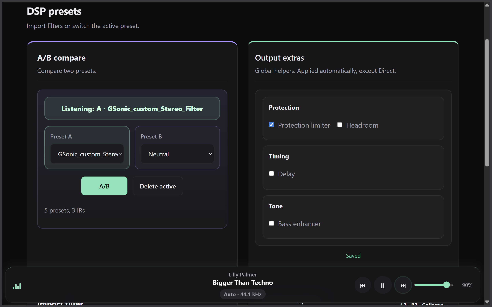

# FXRoute

FXRoute is a browser-controlled audio player and DSP control surface for Linux mini PCs and dedicated audio machines.

It is built for the kind of box you put next to a DAC, amp, or TV: a small Linux PC that runs local playback, radio, EasyEffects, and Spotify desktop control, while every phone, tablet, or laptop on the local network can act as the remote.



| Radio and library control | Spotify desktop control | DSP presets and A/B compare |
| --- | --- | --- |
|  |  |  |

## Why FXRoute

FXRoute focuses on practical high-quality playback on real Linux audio hardware:

- browser control from any device on the local network
- optimized for mini PCs, NUC-style hosts, and dedicated living-room audio boxes, but also perfectly usable on a normal Linux desktop or laptop
- local playback, playlists, and import in one interface
- SomaFM radio with live metadata
- EasyEffects-based DSP workflows with preset switching, convolver, PEQ, and practical helpers
- digital room correction workflows through convolver presets and PEQ / REW-based tuning
- fast A/B comparison for filter and preset listening
- gapless playback for consecutive tracks at the same sample rate
- monitoring and utility features such as peak detection, headroom control, limiter, delay, and bass enhancement
- Spotify desktop control through MPRIS / `playerctl`
- responsive UI for desktop and mobile
- careful sample-rate handling for high-quality playback, including high-resolution setups where the DAC and Linux audio chain support it

## Supported setup

Validated so far:
- Ubuntu
- Fedora
- openSUSE Tumbleweed

Typical real-world setup, but not a requirement:
- mini PC or small desktop near the stereo, DAC, or TV
- Linux desktop session on that machine
- browser control from phone, tablet, or laptop
- optional monitor attached, but not needed day to day

## Important setup assumption

FXRoute is not a pure headless audio stack.

Some of its best features depend on desktop-session apps:
- EasyEffects runs in the local user session
- Spotify control targets the locally running Spotify desktop app

So the intended model is not "cloud server in a rack", but "dedicated Linux audio box you rarely have to touch directly".

## What FXRoute needs

- a Linux desktop session with working audio
- `systemd --user` support
- `mpv`, `ffmpeg`, Python 3, and `playerctl`
- EasyEffects for DSP preset features
- a browser on the same local network

## Scope

FXRoute is intentionally aimed at:
- one personal playback host on the local network
- remote control from desktop or mobile browsers
- high-quality playback plus practical DSP control
- dedicated audio PCs rather than generic cloud music infrastructure

It is currently not trying to be:
- a cloud-hosted music service
- a shared multi-account streaming platform
- a DAW or deep DSP design suite

## Quick start

### Recommended install

Run the installer from the project root:

```bash
./install.sh
```

For a non-interactive run:

```bash
./install.sh -y
```

Default public install path:
- `~/fxroute`

Default user service:
- `fxroute.service`

The installer prepares:
- required system packages
- Python virtual environment
- user service
- EasyEffects bootstrap presets
- optional LAN comfort steps such as `.local` naming and port-80 reverse proxy

### First configuration

If you want to create or adjust the config manually:

```bash
cp .env.example .env
```

Minimum required setting:

```env
MUSIC_ROOT=~/Music
```

Useful optional settings:
- `DOWNLOADS_SUBDIR=incoming`
- `LOG_LEVEL=INFO`
- `HOST=0.0.0.0`
- `PORT=8000`

Downloads are stored under `MUSIC_ROOT/incoming` by default.

## Access and usage

Typical URLs are:
- `http://localhost:8000`
- `http://<host-ip>:8000`
- `http://fxroute.local` when Avahi/mDNS is enabled
- `http://<host-ip>` when the optional port-80 reverse proxy is enabled

Basic flow:
1. Open FXRoute in a browser on your local network.
2. Use **Radio** for SomaFM streaming.
3. Use **Library** for local playback, playlists, and import.
4. Use **Effects** for EasyEffects preset switching, convolver and PEQ work, DRC-oriented tuning workflows, DSP helpers, A/B listening, and utility controls like peak detection, headroom, limiter, delay, and bass enhancement.
5. Use **Spotify** to control a locally running Spotify desktop client.

## Running and service control

### Manual run

```bash
python3 main.py
```

### User service

FXRoute is designed to run as a **systemd user service** so playback stays tied to the desktop session.

| Action | Command |
|--------|--------|
| Status | `systemctl --user status fxroute` |
| Logs | `journalctl --user -u fxroute -f` |
| Restart | `systemctl --user restart fxroute` |
| Stop | `systemctl --user stop fxroute` |
| Disable | `systemctl --user disable fxroute` |

Minimal example unit file:
- `fxroute.service`

## Current limitations and assumptions

- Spotify control uses the local desktop Spotify app through MPRIS / `playerctl`, not the Spotify Web API
- EasyEffects features expect EasyEffects to exist and run in the user session
- LAN comfort features such as `fxroute.local` and port-80 access depend on optional local network setup
- import/download behavior depends on `yt-dlp`, and upstream sites can change over time
- the project is currently Linux-focused

## Optional watchdog for stale EasyEffects Flatpak sockets

If EasyEffects leaves a stale runtime socket behind, FXRoute ships an optional watchdog timer:

```bash
chmod +x ~/fxroute/scripts/easyeffects-stale-watchdog.sh
mkdir -p ~/.config/systemd/user
cp ~/fxroute/systemd-user/easyeffects-stale-watchdog.* ~/.config/systemd/user/
systemctl --user daemon-reload
systemctl --user enable --now easyeffects-stale-watchdog.timer
```

The watchdog only intervenes in a narrow stale-socket case and is not required for normal installs.

## Architecture

```text
fxroute/
├── main.py           # FastAPI app with REST + WebSocket endpoints
├── player.py         # MPV wrapper using JSON IPC
├── stations.py       # SomaFM station fetcher with cache
├── library.py        # Local music scanner (mutagen for metadata)
├── downloader.py     # yt-dlp integration with progress tracking
├── config.py         # Configuration from .env
├── models.py         # Data models
├── requirements.txt  # Python dependencies
├── .env.example      # Example config
├── fxroute.service   # example systemd unit file
├── README.md         # This file
└── static/
    ├── index.html    # Single-page app
    ├── style.css     # Dark theme, responsive
    └── app.js        # Vanilla JS, WebSocket client
```

### Data flow
- frontend connects via WebSocket for real-time state
- REST endpoints for explicit actions like play, pause, import, and effects
- MPV runs as a subprocess with JSON IPC at `/tmp/mpv.sock`
- station data is cached in SQLite at `/tmp/fxroute-cache/stations.db`
- downloads go to `MUSIC_ROOT/incoming/`

## Troubleshooting

### "mpv is not installed"
Install mpv: `sudo apt install mpv`

### "MUSIC_ROOT is not set"
Make sure your `.env` file exists and contains a valid `MUSIC_ROOT`, for example `MUSIC_ROOT=~/Music`

### WebSocket connection fails
- preferred LAN setup: Avahi/mDNS for `fxroute.local` plus Caddy on port 80
- fallback direct app port: `http://<host-ip>:8000`
- check firewall: `sudo ufw allow 8000`
- verify the backend is running: `curl http://localhost:8000/api/status`
- verify the reverse proxy is running: `curl http://localhost/api/status`

### Downloads fail
- ensure yt-dlp is installed: `yt-dlp --version`
- YouTube changes frequently, so if downloads consistently fail, update yt-dlp: `pip install -U yt-dlp`
- some sources have restrictions, try a different URL

### Effects do not apply
- ensure EasyEffects is installed and running in the desktop session
- if preset loading fails, verify FXRoute is still talking to the intended EasyEffects instance

### Spotify tab is empty or controls do not work
- ensure Spotify is installed and currently running in the desktop session
- ensure `playerctl` is installed: `playerctl --version`
- check whether Spotify is visible to MPRIS/playerctl: `playerctl --list-all | grep spotify`
- if nothing shows up, start Spotify locally on the host and try again

### Stations not loading
- the app falls back to a minimal station list if SomaFM API is unreachable
- check network connectivity
- stations may be temporarily unavailable

### No sound
- check that mpv can output audio: `mpv --no-video https://ice1.somafm.com/groovesalad`
- ensure volume is not muted in the app or system

## Contributing

FXRoute is still in an early, tightly curated stage.

Please discuss larger changes before opening a pull request.
Contribution terms are documented in:
- `CONTRIBUTING.md`
- `CONTRIBUTOR-LICENSE-GRANT.md`

## License

GNU AGPLv3
