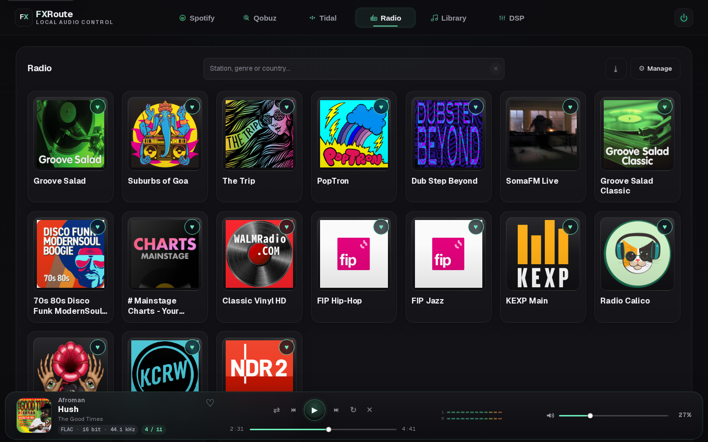
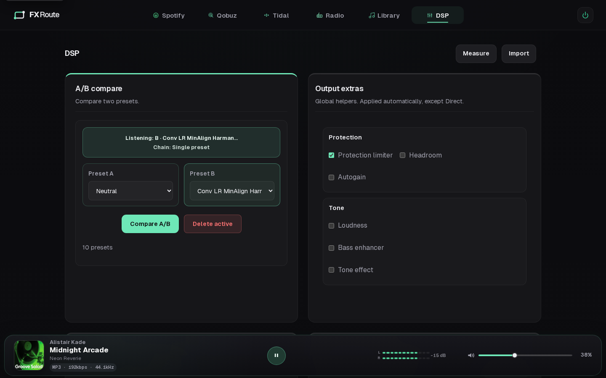
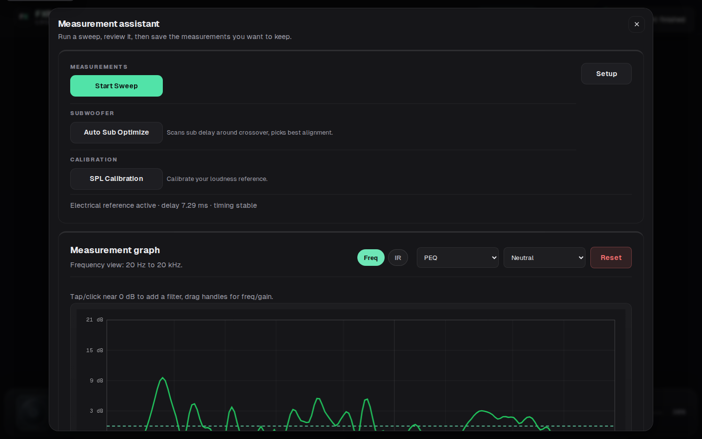

# FXRoute

FXRoute is a browser-based control surface for a Linux hi-fi audio box. One small PC or ARM board with a PipeWire user session becomes the source and DSP hub for local music, internet radio, Spotify, Qobuz, and TIDAL — controlled from any phone, tablet, or laptop on the local network.

Radio, the music library, the streaming providers, the native DSP engine, and the room-measurement tools all in one interface. You browse and play from the couch; FXRoute owns the audio session, the DSP chain, and the output routing on the audio machine.

## Download — FXRoute 1.0 Beta

The central download and release page is [FXRoute 1.0 Beta](https://github.com/CobbyCode/fxroute/releases/tag/v1.0-beta):

- Raspberry Pi 4: [fxroute-1.0-beta-rpi4-trixie-current.img.xz](https://github.com/CobbyCode/fxroute/releases/download/v1.0-beta/fxroute-1.0-beta-rpi4-trixie-current.img.xz) — write to SD card, boot, and finish the web onboarding
- Raspberry Pi 5: [fxroute-1.0-beta-rpi5-trixie-current.img.xz](https://github.com/CobbyCode/fxroute/releases/download/v1.0-beta/fxroute-1.0-beta-rpi5-trixie-current.img.xz) — same procedure
- x86_64 PC as openSUSE Leap 16 installer (via SourceForge): [fxroute-1.0-beta-x86_64-leap16.iso](https://sourceforge.net/projects/fxroute/files/1.0-beta/fxroute-1.0-beta-x86_64-leap16.iso/download)

No new hardware? Try the [web demo](https://cobbycode.github.io/fxroute/) first. Already running Linux on the audio machine? Use the [installer below](#install) instead.

## Web demo

Try the interface without any audio hardware. The demo is the real FXRoute frontend — same checkout, same UI — with some simulated backend for playback, DSP, radio, and measurement, so every view is explorable in a normal browser.

Try it live: https://cobbycode.github.io/fxroute/ — or run it locally:

```bash
git clone https://github.com/CobbyCode/fxroute.git
cd fxroute
python3 scripts/serve_demo.py     # then open http://127.0.0.1:8765
```

The demo page carries a small notice saying the backend is simulated.

<p align="center">
  
  
  
</p>

## What FXRoute does

**Sources**

- Local music library with album browsing, playlists, favorites, uploads, album ZIP imports, media-URL imports, and downloads
- Internet radio with a curated station catalog, personal stations, and Radio Browser search; live metadata and artwork for Radio Paradise, FIP, SomaFM, and KEXP
- Spotify control for a local desktop client or spotifyd (Spotify Connect pairing, no FXRoute login), including Lossless-aware playback through a current desktop client
- Qobuz Connect player control and a full TIDAL catalog browser with native playback through FXRoute's audio engine
- Bluetooth input visibility and control when the host audio stack supports it

**DSP and output**

- A native DSP engine (`fxroute_dsp_sink`) built from source, in the same PipeWire session as playback
- Presets with A/B compare, preset combining, and filter imports; two always-available presets: **Direct** (bypasses everything) and **Neutral** (clean chain, the default)
- Global output helpers that apply on top of any preset: protection limiter, headroom, autogain, loudness contouring, bass enhancer, and tone effect
- Stereo, 2.1, 2.2, and 2.2 Stereo Bass output modes with crossover, level, polarity, and alignment controls
- Auto or fixed sample rate (up to 384 kHz, device permitting)

**Measure and correct**

- Host-microphone room and speaker measurement: single L/R/Stereo sweeps, same-position L/R Repeat, and a guided multi-position Advanced workflow
- SPL calibration with UMIK-1/UMIK-2/Dayton UMM-6 support or a manual meter
- Auto Sub Optimize for subwoofer alignment in subwoofer output modes
- Correction tools on the measurement graph: a 12-filter PEQ sketchpad, custom House Curves, and FIR convolver preset creation in linear, minimum-phase, and aligned modes

**System**

- Control from any browser on the LAN; SMB music shares in addition to the local folder
- Optional local HTTPS via Caddy with a downloadable certificate
- `GET /api/power/state` as a read-only hint for amplifier smart-plug automation
- In-app maintenance updates, plus the downloadable images above

## Install

**Classic install** on a Linux PC or board with PipeWire:

```bash
git clone https://github.com/CobbyCode/fxroute.git
cd fxroute
./install.sh
```

The installer prepares the system packages, builds the native DSP engine, creates the Python virtualenv, and enables the `fxroute.service` user service. Run it as the audio user; from a root shell on a host with several users, pass that user explicitly with `./install.sh --user <name>`. Custom install targets must be dedicated directories named `fxroute` unless `--local-project` is used (that flag installs in place from the current project directory).

Supported package managers are apt, dnf, zypper, and pacman. The provider matrix, first-run authentication, and uninstall behavior are covered in [docs/INSTALLER.md](docs/INSTALLER.md).

## First start

- `systemctl --user status fxroute` — the service is `fxroute.service`.
- Open the UI from any browser on the network:
  - `http://fxroute.local:8000` (mDNS; the name is set in **Technical settings → Device Name**; the downloadable images install a unique id, e.g. `http://fxroute-ab12cd.local:8000`)
  - `http://<host-ip>:8000`
  - `http://localhost:8000` on the audio PC itself
  - `https://<host-ip>` or `https://<device-name>.local` when the optional HTTPS proxy is enabled (HTTP stays reachable)
- Play something from **Radio** or **Library** to confirm audio and DSP routing.
- The music folder is configured in `.env` (`MUSIC_ROOT`) or selected in **Technical settings → Music Library**, which also lists discovered SMB shares.

## Home Assistant

`GET /api/power/state` is a read-only amplifier power hint for external automation: `amp_should_be_on` is true while local or Spotify playback is active or the Measurement Assistant is open. FXRoute does not require MQTT. A complete configuration example is in the [manual](MANUAL.md#10-home-assistant--external-automation).

## Documentation

- [MANUAL.md](MANUAL.md) — the short user manual
- [docs/INSTALLER.md](docs/INSTALLER.md) — installer, providers, and uninstall details
- [docs/INSTALL-ARMBIAN.md](docs/INSTALL-ARMBIAN.md) and [docs/INSTALL-ISO.md](docs/INSTALL-ISO.md) — building the ARM64 board images and the x86_64 installation ISO yourself
- [CHANGELOG.md](CHANGELOG.md) — release history

## License

AGPL-3.0 — see [LICENSE](LICENSE).
