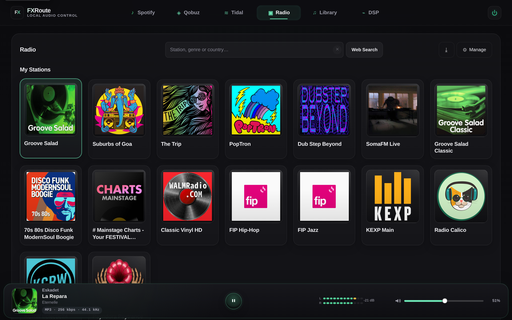
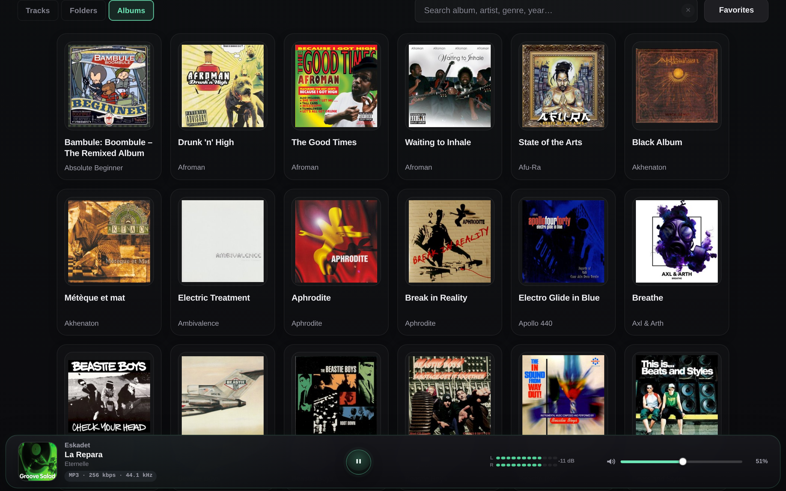
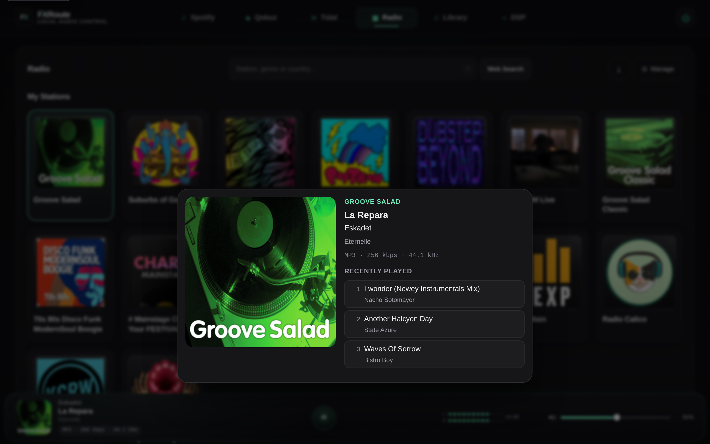
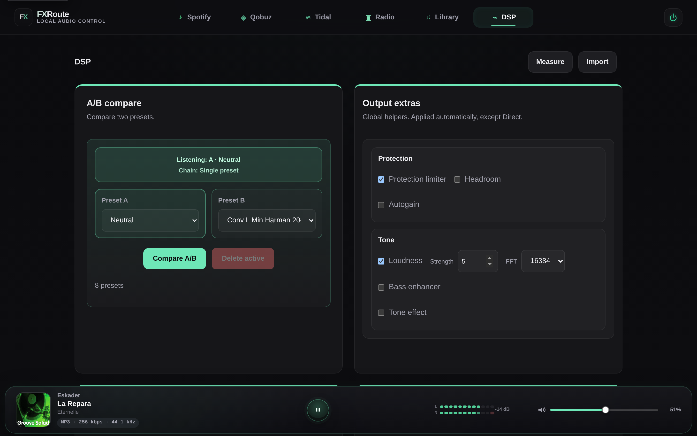
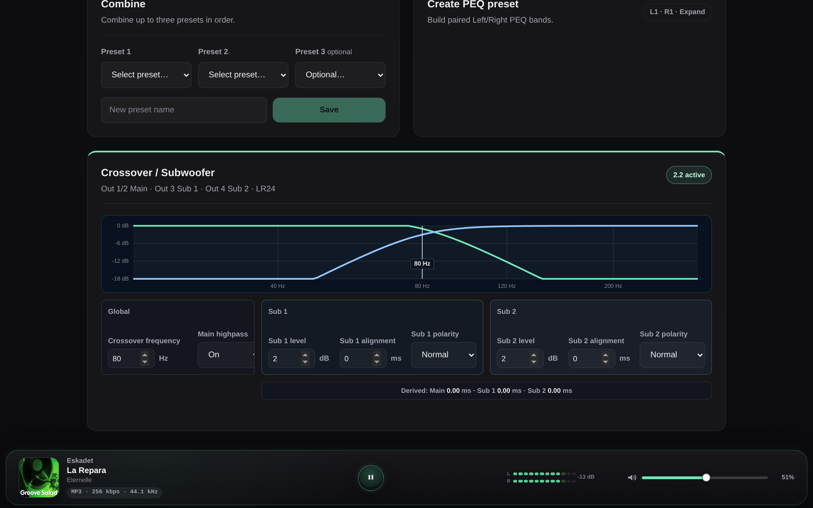
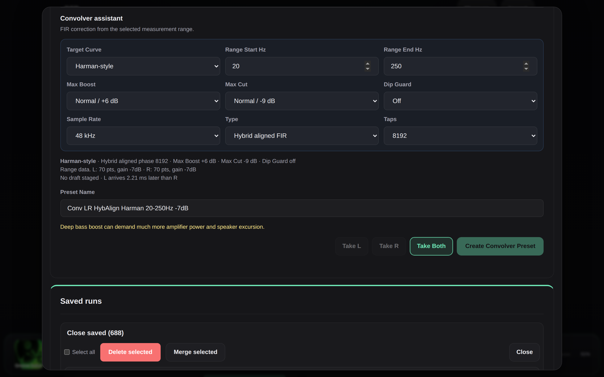
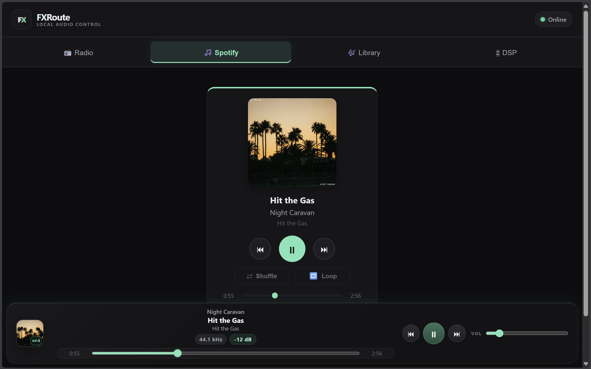
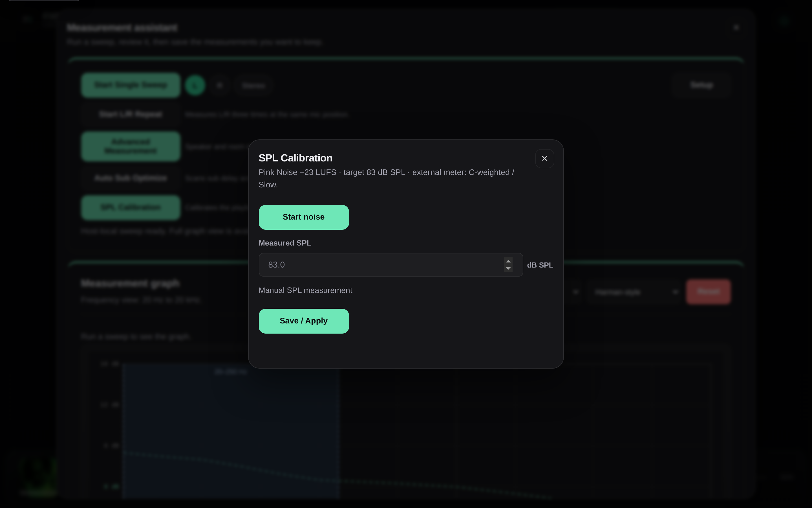
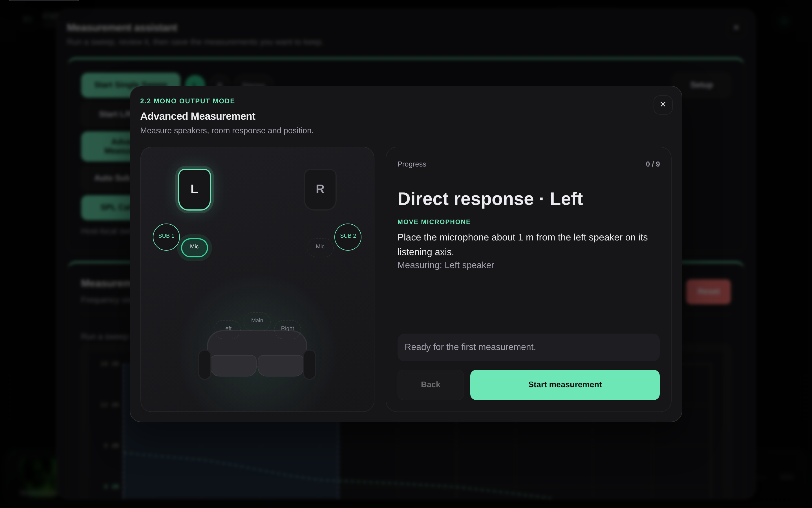

# FXRoute

FXRoute is a browser-based control surface for Linux audio systems.

It runs on mini PCs, desktops, ARM boards, and dedicated stereo systems. It combines local playback, FXRoute's native DSP engine, radio, library playback, measurement tools, and optional Spotify desktop control in one interface for phones, tablets, and laptops on the local network.

<p align="center">
  <strong>Measure, compare, and sketch PEQ/convolver corrections directly in the browser.</strong>
</p>

<table>
  <tr>
    <td width="33%"></td>
    <td width="33%"></td>
    <td width="33%"></td>
  </tr>
  <tr>
    <td align="center"><strong>Radio</strong></td>
    <td align="center"><strong>Desktop library</strong></td>
    <td align="center"><strong>Queue / Now Playing</strong></td>
  </tr>
  <tr>
    <td width="33%"></td>
    <td width="33%"></td>
    <td width="33%"></td>
  </tr>
  <tr>
    <td align="center"><strong>DSP – A/B Compare &amp; Output Helpers</strong></td>
    <td align="center"><strong>Crossover / Subwoofer</strong></td>
    <td align="center"><strong>Convolver / Measurement</strong></td>
  </tr>
  <tr>
    <td width="33%"></td>
    <td width="33%"></td>
    <td width="33%"></td>
  </tr>
  <tr>
    <td align="center"><strong>Spotify</strong></td>
    <td align="center"><strong>SPL Calibration</strong></td>
    <td align="center"><strong>Advanced Measurement</strong></td>
  </tr>
</table>

## What it does

- browser interface for desktop and mobile control
- local music playback with queue, playlists, uploads, ZIP album imports, album browsing, cached album metadata, artist info, similar-artist discovery, and media URL imports
- internet radio with a curated station catalog, personal station management
  (add/edit/delete streams with custom artwork), Radio Browser station search,
  and enriched metadata and artwork for Radio Paradise, FIP, SomaFM, and KEXP
- Spotify desktop control through `playerctl` / MPRIS, including passive metadata refresh for automatic track changes
- Spotify Lossless playback through a current local Spotify desktop client for eligible Premium accounts, when Lossless is enabled in Spotify (up to 24-bit/44.1 kHz FLAC); FXRoute provides remote client control, not the Spotify stream
- native DSP preset switching, PEQ, convolver import/generation, output helpers, and A/B compare
- stereo, 2.1 subwoofer, and 2.2 subwoofer output modes
- global DSP helpers for protection, gain management, loudness contouring, bass enhancement, and tone shaping; Loudness provides a calibrated contour that follows the playback level and also accounts for the Auto Gain target when both are active
- room and speaker measurements with host microphone capture, including Advanced Measurement to measure speakers, room response, and microphone position,
  calibration files, calibration-file export, smoothing, saved runs, a
  twelve-filter PEQ editor, custom House Curve editing and export, PEQ filter
  transfer, and stereo FIR/convolver preset creation with linear, minimum-
  phase, minimum-aligned, and hybrid-aligned modes
- SPL Calibration with −23-LUFS pink noise, automatic UMIK-1 / UMIK-2 /
  Dayton UMM-6 SPL measurement, and manual C-weighted/Slow meter fallback;
  Auto Gain and Loudness are neutralized only for calibration
- Auto Sub Optimize with measured delay, polarity, and target-aware subwoofer
  gain verification for 2.1 and 2.2 output modes; confirmed AutoGain searches
  can use up to ±6 dB while four final Stage outputs are checked against
  −1 dBFS
- automatic or fixed sample-rate playback handling for local files, radio, Spotify, and Bluetooth handoff cases; FXRoute supports sample rates up to 384 kHz, subject to the capabilities of the selected audio device
- rich now-playing and cover detail views for local, radio, and Spotify
  playback, including stream tech lines (codec/bitrate/sample rate) and
  tag-info blocks
- Bluetooth input visibility/control when the host audio stack supports it
- optional local HTTPS/Caddy setup with downloadable local certificate for trusted LAN clients
- selectable local and SMB music libraries, with SMB share discovery and manual `smb://` share entry
- optional Spotify Desktop, spotifyd, Qobuz/qbzd, and TIDAL installer support; see [docs/INSTALLER.md](docs/INSTALLER.md)
- installer support for the native DSP build, systemd user service, PipeWire/BlueZ dependencies, firewall comfort rules, and `.local` LAN naming
- installer package-manager support for apt (Debian/Ubuntu), dnf (Fedora),
  zypper (openSUSE), and pacman (Arch/Manjaro); package-manager preparation
  avoids repeated refreshes, with a required metadata refresh when a new
  Spotify apt source is added

## Intended setup

FXRoute runs in a **Linux user session with an active PipeWire audio stack**. That session can be a desktop session or a headless CLI/minimal setup (for example ARM64 Armbian) with the user services enabled. FXRoute is not intended to run as a system daemon.

Typical setup:

- small PC or ARM board near DAC, amp, active speakers, headphones, or TV
- PipeWire-based Linux user session (desktop or headless)
- FXRoute's native DSP engine in the same local PipeWire session
- optional Spotify desktop client in the same session
- control from any browser on the LAN

FXRoute coordinates local audio applications, its DSP engine, MPRIS/playerctl, and PipeWire routes through that user session. Playback applications enter the processing graph through the FXRoute-owned `fxroute_dsp_sink` Pulse/PipeWire sink.

## Requirements

On supported distributions, `install.sh` installs and configures the runtime tools: Python dependencies, `mpv`, `ffmpeg`, `playerctl`, Bluetooth/PipeWire helpers, and service files.

The installer builds the native DSP engine from the source shipped with FXRoute. A C compiler, `pkg-config`, PipeWire development headers, and the LV2 libraries and plugin packages used by the DSP effects (LSP, Zam, Calf) are installed on supported distributions.

Tested installer targets so far include:

- Ubuntu 24.04 and 26.04 on x86_64
- Manjaro / Arch-family x86_64 systems
- openSUSE Tumbleweed on x86_64
- Fedora-family x86_64 systems
- Armbian 26.2.1 / Ubuntu 24.04 Noble on ARM64 (`aarch64`, Khadas VIM1S; PipeWire setup may be needed depending on the image)

## Native DSP engine

FXRoute builds and runs its own PipeWire-native DSP engine. The stable ingress sink is `fxroute_dsp_sink`; the processing node is `fxroute_dsp`.

Fresh installs on x86_64 default Spotify autostart to enabled when a local Spotify desktop client is available, so the player can return after a desktop/session restart. Other architectures default Spotify autostart to disabled. Existing `.env` files are preserved on installer reruns.

## Maintenance updates

Installed git checkouts can be updated from **Technical settings → Maintenance** or from the `fxroute-update` helper. The update path uses the same install root, service name, virtualenv, and systemd user service assumptions as `install.sh`.

## Home Assistant / external automation

FXRoute exposes `GET /api/power/state` as a read-only power hint for external automation. It returns `amp_should_be_on: true` when local or Spotify playback is active, or when the Measurement Assistant is open. Home Assistant or another automation system can use this hint to control an amplifier smart plug or power socket. FXRoute does not require an MQTT broker and does not control the smart plug directly.

Minimal Home Assistant example:

```yaml
rest:
  - resource: "http://fxroute.local:8000/api/power/state"  # Adapt host/port if needed.
    scan_interval: 5
    binary_sensor:
      - name: "FXRoute Amp Should Be On"
        value_template: "{{ value_json.amp_should_be_on }}"
    sensor:
      - name: "FXRoute Amp Reason"
        value_template: "{{ value_json.reason }}"

automation:
  - alias: "FXRoute amp on"
    trigger:
      - platform: state
        entity_id: binary_sensor.fxroute_amp_should_be_on
        to: "on"
    action:
      - service: switch.turn_on
        target:
          entity_id: switch.verstaerker_steckdose  # Adapt to your smart plug entity.

  - alias: "FXRoute amp off after idle"
    trigger:
      - platform: state
        entity_id: binary_sensor.fxroute_amp_should_be_on
        to: "off"
        for:
          minutes: 20
    action:
      - service: switch.turn_off
        target:
          entity_id: switch.verstaerker_steckdose  # Adapt to your smart plug entity.
```

## Quick start

```bash
chmod +x install.sh
./install.sh
```

The installer creates `.env` automatically and preserves it on reruns. For manual setup, copy `.env.example` to `.env` and adjust at least `MUSIC_ROOT` when needed. Network libraries can be selected in **Technical settings**. FXRoute discovers accessible SMB shares and also accepts a manual `smb://server/share` entry.

Optional streaming providers are never selected by default in a non-interactive install. Select them explicitly, for example:

```bash
./install.sh --providers spotify-desktop,spotifyd,qobuz,tidal
```

Spotify Desktop and spotifyd are independent choices. Spotify Desktop is limited to x86_64 desktop sessions; spotifyd and Qobuz/qbzd also support headless user sessions where their architecture is available. The installer does not write provider credentials or session data. See [docs/INSTALLER.md](docs/INSTALLER.md) for the supported matrix, first-run authentication, and uninstall behavior.

Default user service:

- `fxroute.service`

Typical URLs:

- `http://localhost:8000`
- `http://<host-ip>:8000`
- `http://fxroute.local` when mDNS is enabled
- `https://<host-ip>` or `https://fxroute.local` when the optional local HTTPS proxy is enabled

## Main sections

- **Radio** — curated station catalog, personal stations, Radio Browser search, live metadata and artwork for Radio Paradise, FIP, SomaFM, and KEXP
- **Library** — local files, album browsing, cached metadata, artist info, similar-artist discovery, playlists, uploads, imports, downloads, and deletion
- **DSP** — native DSP presets, PEQ, convolver, helpers, A/B compare, and preset creation
- **Measure** — host-mic measurement, Advanced Measurement, subwoofer optimization, and tuning workflow
- **Spotify** — control a local Spotify desktop client
- **Technical settings** — output selection, Stereo/2.1/2.2 modes, Auto or fixed sample rate, music libraries, source state, Bluetooth status, Maintenance updates, and local certificate access

## Library metadata

FXRoute keeps local tags and local cover files as the source of truth, then enriches albums opportunistically with cached MusicBrainz IDs, Cover Art Archive fallback covers, compact album facts, optional Wikipedia/Wikidata artist summaries, and ListenBrainz similar-artist discovery.

Metadata is cached locally so normal library scans stay fast and unchanged tracks do not need full audio probing on every run.

## Measurement and convolver presets

The Measure workflow creates native DSP FIR/convolver presets from
saved measurements. For stereo correction, measure and save left and right
separately, assign them in the Convolver assistant, then choose the target
curve, correction range, phase mode, sample rate, and tap length.

The Measurement assistant also includes:

- a temporary PEQ editor with up to 12 filters before creating a preset
- a Custom House Curve editor with up to 8 frequency/gain points
- export of managed microphone calibration files and House Curve files

Create Custom House Curves on the graph or edit them numerically. FXRoute saves
them in the target-file format used by the existing House Curve workflow.
Calibration and House Curve files can be exported again from the Measurement
setup after they have been imported or created.

Available phase modes:

- **Linear phase** — symmetric FIR correction.
- **Minimum phase** — default for broad room/speaker correction.
- **Minimum phase aligned** — minimum-phase correction with measured L/R direct-arrival alignment for separately saved stereo measurements.
- **Hybrid aligned** — minimum-phase bass correction blended into zero-delay linear-style upper correction, using the same L/R timing safety gate as Minimum phase aligned for stereo filters.

## Service commands

```bash
systemctl --user status fxroute
systemctl --user restart fxroute
journalctl --user -u fxroute -f
```

Useful DSP graph checks:

```bash
wpctl status
pw-cli ls Node | grep fxroute_dsp
```

## Manual

See [MANUAL.md](MANUAL.md) for the short user manual.

## License

See [LICENSE](LICENSE).
