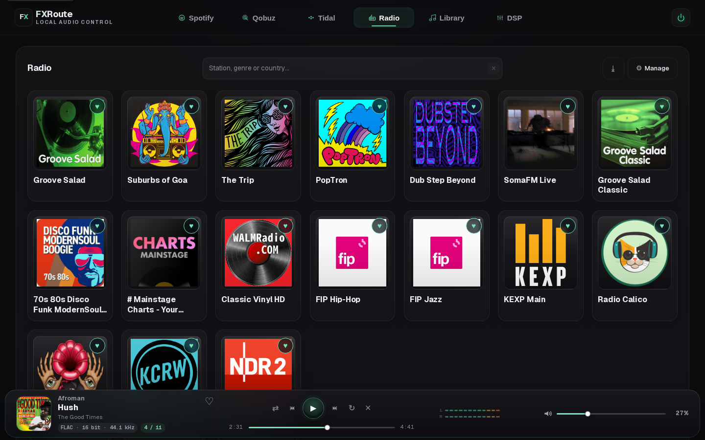
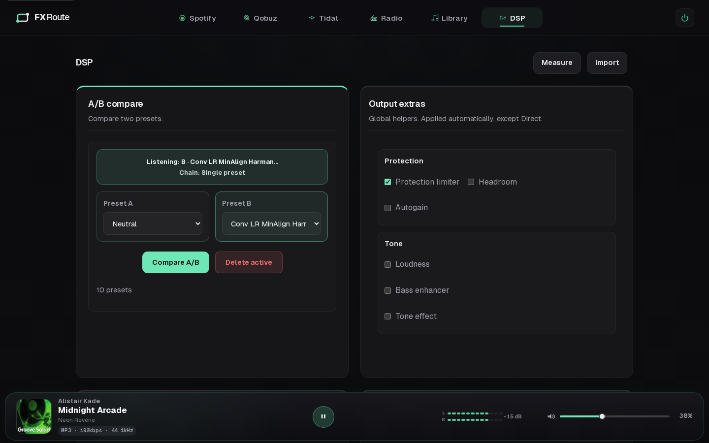
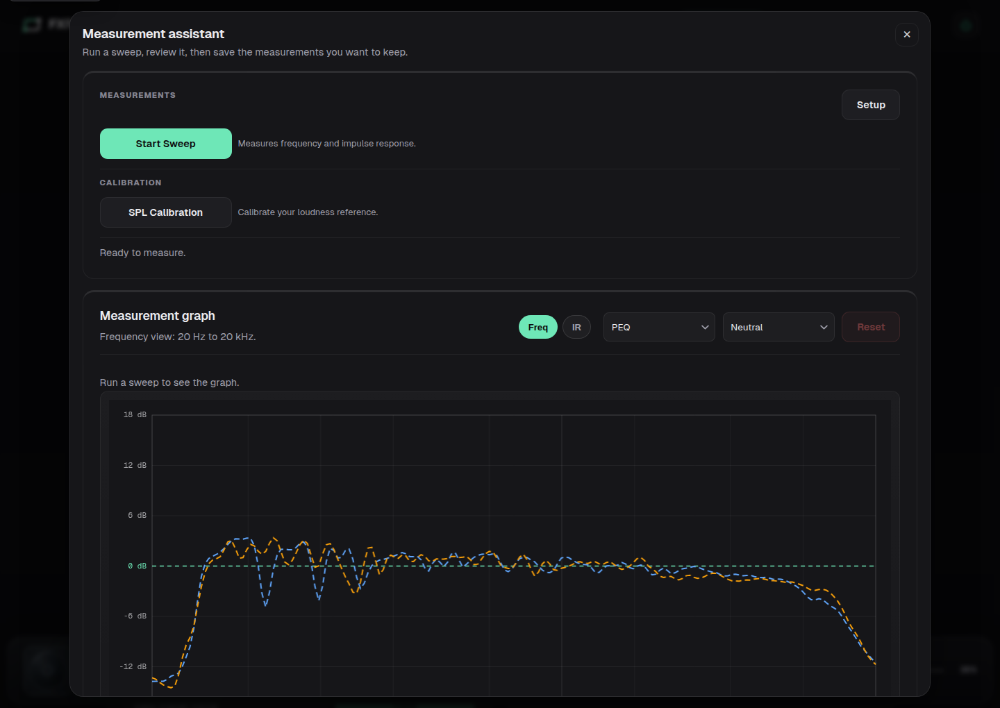

# FXRoute

FXRoute is a browser-based control surface for a Linux hi-fi audio box. One small PC or ARM board with a PipeWire user session becomes the source and DSP hub for local music, internet radio, Spotify, Qobuz, and TIDAL — controlled from any phone, tablet, or laptop on the local network.

Radio, the music library, the streaming providers, the native DSP engine, and the room-measurement tools all in one interface. You browse and play from the couch; FXRoute owns the audio session, the DSP chain, the output routing, and the measurement on the audio machine.

## Download

Start from [FXRoute releases](https://github.com/CobbyCode/fxroute/releases). The release notes list every published artifact and where to fetch it: the Raspberry Pi 4 / Pi 5 SD-card image (GitHub Release) and the x86_64 Ubuntu 26.04 installation ISO (SourceForge). Write the image or ISO to disk, boot it, and finish the web onboarding.

No new hardware? Try the [web demo](#web-demo) first. Already running Linux on the audio machine? Use the [installer](#install) instead.

## Web demo

Try the interface without any audio hardware, directly in your browser: https://cobbycode.github.io/fxroute/

The demo is the real FXRoute frontend — same UI — with simulated backend state for playback, DSP, radio, and measurement, so every view is explorable in a normal browser.

<p align="center">
  
  
  
</p>

## What FXRoute does

**Sources**

- Local music library with album, track, folder, and favorites views, playlists, uploads, album ZIP imports, media-URL imports, and multi-select downloads
- Internet radio with a curated station catalog, personal stations, and Radio Browser search; live metadata and artwork for Radio Paradise, FIP, SomaFM, and KEXP
- Spotify control for a local desktop client or spotifyd (Spotify Connect pairing, no FXRoute login), including Lossless-aware playback through a current desktop client
- Qobuz Connect player control and a full TIDAL catalog browser with native playback through FXRoute's audio engine
- Bluetooth and external line input as selectable sources when the host audio stack supports them

**DSP and output**

- A native DSP engine (`fxroute_dsp_sink`) built from source, in the same PipeWire session as playback
- One output-routing model: **Stereo** or **Stereo + Sub**, an independent Crossover switch, and **Output Routing** that assigns roles (`Main L/R`, speaker ways, `Sub L`, `Sub R`, `Sub 1`, `Sub 2`) to hardware outputs
- Crossover derived from the routing as a 2-, 3-, or 4-way system with per-way type, slope, level, alignment, and polarity; the subwoofer configuration (**Mono sub**, **Dual-mono subs**, **Stereo subs**) is derived from the routed sub roles
- Presets per **filter bank** (Global, the way pairs, the subs) with A/B compare, preset combining, and filter imports; two always-available presets: **Direct** (bypasses everything) and **Neutral** (clean chain, the default)
- Global output helpers that apply on top of any preset: protection limiter, headroom, autogain, loudness contouring, bass enhancer, and tone effect
- Auto or fixed sample rate (up to 384 kHz, device permitting), with rate-driven channel tiers on interfaces that have them

**Measure and correct**

- Host-microphone room and speaker measurement: single L/R/Stereo sweeps scoped to the selected measuring area, same-position L/R Repeat, and a guided multi-position Advanced workflow
- An **electrical reference** input on the capture interface for precise arrival timing, and an electrical-reference or acoustic-only timing verdict on every run
- **Speaker Auto Alignment** per speaker for a multi-way crossover: proposes per-way delay and gain, then verifies acoustically before committing
- **Auto Sub Optimize** scans delay, polarity, and level around the current subwoofer settings for the derived sub layout and applies the verified winner
- SPL calibration with UMIK-1/UMIK-2/Dayton UMM-6 support or a manual meter
- Correction tools on the measurement graph: a 12-filter PEQ sketchpad, custom house curves, and FIR convolver preset creation in linear, minimum-phase, and aligned modes

**System**

- Control from any browser on the LAN; SMB music shares in addition to the local folder
- Optional local HTTPS via Caddy with a downloadable certificate
- `GET /api/power/state` as a read-only hint for amplifier smart-plug automation
- In-app maintenance updates, plus the downloadable images above

## Install

**Classic install** on a Linux PC or board with PipeWire:

```bash
git clone https://github.com/CobbyCode/fxroute.git
cd fxroute
./install.sh
```

The installer prepares the system packages, builds the native DSP engine, creates the Python virtualenv, and enables the `fxroute.service` user service. Run it as the audio user; from a root shell on a host with several users, pass that user explicitly with `./install.sh --user <name>`. Custom install targets must be dedicated directories named `fxroute` unless `--local-project` is used (that flag installs in place from the current project directory).

Supported package managers are apt, dnf, zypper, and pacman. Streaming providers are optional and always resolve the current stable upstream release. The provider matrix, first-run authentication, and uninstall behavior are covered in [docs/INSTALLER.md](docs/INSTALLER.md).

## First start

- `systemctl --user status fxroute` — the service is `fxroute.service`.
- Open the UI from any browser on the network:
  - `http://fxroute.local:8000` (mDNS; the name is set in **Technical settings → Device Name**; the downloadable images install a unique id, e.g. `http://fxroute-ab12cd.local:8000`)
  - `http://<host-ip>:8000`
  - `http://localhost:8000` on the audio PC itself
  - `https://<host-ip>` or `https://<device-name>.local` when the optional HTTPS proxy is enabled (HTTP stays reachable)
- Play something from **Radio** or **Library** to confirm audio and DSP routing.
- The music folder is configured in `.env` (`MUSIC_ROOT`) or selected in **Technical settings → Music Library**, which also lists discovered SMB shares.

## Home Assistant

`GET /api/power/state` is a read-only amplifier power hint for external automation: `amp_should_be_on` is true while local, TIDAL, Spotify, or Qobuz playback is active, while the measurement assistant is open, while Bluetooth audio is streaming, or while an external input is routed. The payload also carries a `reason` field. FXRoute does not require MQTT. A complete configuration example is in the [manual](MANUAL.md#10-home-assistant--external-automation).

## Documentation

- [MANUAL.md](MANUAL.md) — the user manual: output modes and routing, crossover, subwoofers, the measurement assistant, and the settings
- [docs/INSTALLER.md](docs/INSTALLER.md) — installer, providers, and uninstall details
- [docs/INSTALL-ARMBIAN.md](docs/INSTALL-ARMBIAN.md) — building the ARM64 board images yourself
- [CHANGELOG.md](CHANGELOG.md) — release history

## License

AGPL-3.0 — see [LICENSE](LICENSE).
